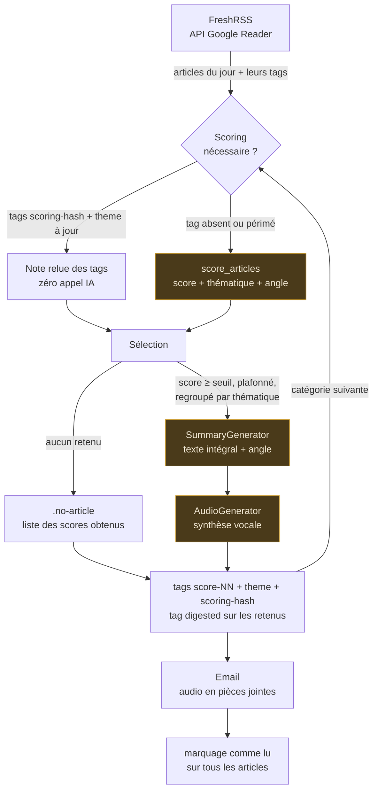
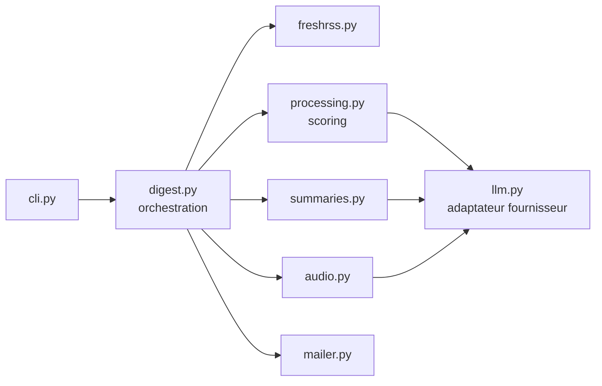

# Fonctionnement de RSSResume

Ce document décrit ce que fait une exécution, dans l'ordre, et pourquoi chaque étape est là.
Pour l'installation et les commandes, voir [README.md](README.md).

## Vue d'ensemble



Les trois blocs ambrés sont les seuls qui appellent l'API payante.

Tout ce qui précède l'email se répète **par catégorie**, tags compris. Seul le marquage comme lu
attend la livraison, une fois toutes les catégories traitées.

## Les étapes

### 1. Sélection des catégories

`RSSRESUME_CATEGORIES` si elle est définie, sinon toutes les catégories découvertes dans FreshRSS,
moins `RSSRESUME_EXCLUDED_CATEGORIES` (comparaison insensible à la casse). Les flux FreshRSS sans
catégorie ne sont jamais traités.

Les étapes 2 à 6 sont ensuite répétées **par catégorie**. Les étapes 7 et 8 n'ont lieu qu'une fois,
après la dernière catégorie.

### 2. Récupération des articles

Pagination par 100 sur `stream/contents`, filtrée sur la journée demandée en UTC. Chaque article
remonte avec ses **tags utilisateur déjà posés** (`Article.tags`) — c'est ce qui rend le cache de
scoring possible à l'étape suivante.

Une catégorie sans article s'arrête ici : un fichier marqueur vide `<categorie>.no-article` est
écrit, et aucun appel IA n'est déclenché.

### 3. Scoring

Chaque article reçoit une **note** selon un profil de pertinence unique
([profil.py](rssresume/profil.py)). Le scoring ne voit que le **titre et un extrait de
400 caractères** : c'est une étape de tri, pas de compréhension.

Une note, c'est trois champs — et les trois servent :

| Champ | Ce que c'est | Où il sert |
| --- | --- | --- |
| `score` | 0 à 10 | seuil de sélection, plafond, tag `score-NN` |
| `thematique` | reglementaire, cyber, marche, stack, autre | ordre de lecture du digest, tag `theme-<x>` |
| `angle` | une phrase : en quoi l'article compte pour ce profil | passé au résumeur avec l'article |

Les trois arrivent dans le même appel. Le score seul pilotait tout et les deux autres étaient
jetés : payés puis perdus. L'angle est précisément le contexte qui manquait au résumé — il dit
*pourquoi* l'article est là — et la thématique donne gratuitement le regroupement à l'écoute.

Trois cas par article :

```
article porte scoring-<hash courant> + score-NN + theme-<x>  →  note relue des tags, aucun appel
article porte scoring-<autre hash>                           →  renoté, anciens tags à nettoyer
article sans tag de scoring                                  →  noté
```

Le cache exige le score **et** la thématique : une note partielle rangerait l'article dans le
mauvais groupe, elle est donc traitée comme absente. L'angle, lui, n'est pas mis en tag — une
phrase entière n'a rien à faire dans un label FreshRSS. Un article relu du cache part donc au
résumé sans son angle, et le prompt le prévoit.

Les articles à noter partent par lots de 40 en un appel chacun. Le module vérifie que le modèle
renvoie **autant de notes que d'articles envoyés** ; sinon l'exécution s'arrête plutôt que de
digérer une sélection silencieusement tronquée.

**Le modèle ne voit jamais les identifiants FreshRSS.** Chaque article part sous un numéro local
de 1 à N, et les notes sont réalignées à l'arrivée. Un identifiant comme
`tag:google.com,2005:reader/item/000659ce0338ac4f` revenait altéré assez souvent pour faire
échouer tout le lot. Si un numéro est malgré tout illisible ou dupliqué, la note est rattachée à
la première place libre — l'ordre de réponse est imposé par le prompt — et un avertissement est
tracé dans les logs.

Sans API configurée, cette étape est sautée : tous les articles passent à l'étape 4.

### 4. Sélection

Articles dont le score atteint `RSSRESUME_SCORE_THRESHOLD` (défaut 7), triés par score décroissant,
plafonnés à `RSSRESUME_MAX_DIGEST_ITEMS` (défaut 12).

**Puis regroupés par thématique.** Le plafond s'applique sur le score — c'est lui qui décide qui
entre —, mais l'ordre de lecture, lui, est thématique : le tri par score seul faisait sauter du
réglementaire au cyber, puis au marché, puis de nouveau au réglementaire, ce qui interdit toute
transition à l'oral. L'urgence reste respectée : un groupe est classé sur son meilleur article,
et à l'intérieur d'un groupe l'ordre reste le score décroissant. Le regroupement ne coûte aucun
appel supplémentaire, la thématique étant déjà notée.

C'est cette sélection — et elle seule — qui alimente le résumé **et** qui reçoit le tag `digested`.
Les deux ne peuvent pas diverger : un test le verrouille.

**Sélection vide.** Si aucun article n'atteint le seuil, la catégorie s'arrête ici, comme une
catégorie sans article : ni résumé ni synthèse vocale — l'audio n'aurait rien à dire. Le marqueur
`<categorie>.no-article` est écrit, mais avec la liste des scores obtenus :

```
Aucun article retenu sur 3 (seuil 7).

 5/10 stack         - Un nouveau format d'archive open source
 4/10 marche        - Bilan trimestriel d'un fournisseur cloud américain
 1/10 autre         - Test d'un casque audio sans fil
```

C'est ce qui permet de juger un seuil trop haut sans rouvrir FreshRSS. Les tags de scoring, eux,
sont écrits normalement (étape 6) : sans cela un lot entièrement sous le seuil serait renoté à
chaque passage.

### 5. Résumé et audio

Le résumé reçoit le **texte intégral** des articles retenus, sans troncature, chacun accompagné de
sa thématique et de son `angle` — la phrase du scoring qui dit en quoi l'article compte pour ce
profil. C'est l'angle à prendre, pas une phrase à recopier, et il ne coûte rien : il est produit par
l'appel de scoring, qui a déjà eu lieu.

Le texte est écrit pour être **écouté**, pas lu, ce qui dicte quatre contraintes :

- **prose continue** : des phrases enchaînées avec des transitions, jamais de puces ni de
  « premièrement, deuxièmement » — une énumération à l'oral ne s'écoute pas ;
- **aucun lien** : l'URL des articles n'est même pas mise dans le prompt. Ce qui n'entre pas dans
  le contexte ne peut pas ressortir dans le texte lu à voix haute — et une URL vue par le modèle
  est une URL qu'il peut recopier de travers. L'attribution passe donc par le **nom du flux**,
  cité entre parenthèses : « … (CERT-FR) », ou « … (CERT-FR, LeMagIT) » pour un fait couvert par
  plusieurs sources. Le champ `feed` est la seule source de vérité ; tout nom absent des articles
  reçus serait inventé. Les liens, eux, partent dans l'email (étape 7) ;
- **fin brève** : « Bonne journée. » et rien de plus. La conclusion passe-partout sur l'importance
  de la sécurité est explicitement interdite — entendue tous les jours, elle n'apporte rien ;
- **longueur proportionnée au volume**, sans quoi le même texte servirait pour 3 comme pour 30
  articles :

| Articles retenus | Profondeur demandée |
| --- | --- |
| ≤ 3 | deux à trois phrases par sujet |
| ≤ 8 | une à deux phrases par sujet |
| > 8 | une phrase par sujet, les sujets proches fondus ensemble |

Les articles arrivent dans l'ordre de lecture décidé à l'étape 4, regroupés par thématique. Le
prompt demande de garder cet ordre et de marquer le passage d'une thématique à la suivante par une
transition courte — sans annoncer de rubrique, ce qui reviendrait à réintroduire une liste.

**Fusion des doublons.** Un même événement est souvent couvert par plusieurs flux : trois dépêches
sur le même incident produisaient trois passages, dont deux redites que l'auditeur subit sans pouvoir
sauter. Le prompt impose donc de traiter ces articles comme **un seul sujet** — le fait dit une seule
fois, les sources qui l'ont couvert nommées ensemble, ce que chacune apporte de plus gardé au même
endroit — et les paliers de longueur ci-dessus se comptent en sujets après fusion, pas en articles
reçus.

**Le cas des CVE.** Les vulnérabilités sortent du régime commun : **une CVE est un sujet à elle
seule**, jamais fondue avec une autre — même jour, même source et même produit n'y changent rien —
et les paliers de longueur ne s'y appliquent pas. Chacune se dit en une à deux phrases factuelles,
dans un ordre fixe : identifiant, produit et versions, ce que la faille permet, exploitée ou non,
ce qu'il y a à faire. C'est le seul endroit du digest où la précision passe avant le style : les
règles de prose, de fusion et de longueur diluaient exactement ce qui rend un avis utile.

Un avis de vulnérabilité arrive souvent réduit à son titre :
« CVE-2026-1234 : élévation de privilèges dans le composant X ». Résumer cela ne dit ni ce qui est
touché, ni s'il faut agir — le modèle ne peut que paraphraser le titre. Avant le résumé, la page de
l'avis est donc lue (`cve.py`) et son texte ajouté au contenu de l'article, ce qui permet de dire en
deux phrases le produit et les versions concernés, ce que la faille permet, si elle est exploitée et
ce qu'il y a à faire.

La lecture est ciblée pour ne pas coûter cher : uniquement les articles qui mentionnent une CVE
**et** dont le flux fournit moins de 1200 caractères — au-delà, le détail est déjà là. Le texte
extrait est plafonné à 6000 caractères (au-delà, on paierait des tokens pour des menus et des pieds
de page) et les blocs `<script>`/`<style>` sont retirés avant les balises. Une page injoignable
n'est pas bloquante : l'article repart tel quel, le digest du jour se fait quand même.

Le texte produit part ensuite en synthèse vocale (API OpenAI-compatible, sinon `espeak` en local).
`OPENAI_TTS_INSTRUCTIONS` permet de diriger la diction — ton, débit, émotion, prononciation.
Ces consignes ne sont **pas** envoyées quand la variable est vide : les modèles de synthèse plus
anciens, `tts-1` en tête, rejettent les paramètres qu'ils ne connaissent pas.

### 6. Tags de la catégorie

Dès que le résumé de la catégorie est produit, ses tags sont écrits : nettoyage des tags périmés,
`score-NN`, `theme-<thematique>`, `scoring-<hash>`, puis `digested` sur les retenus.

**Pourquoi ici et pas à la fin.** Ce sont des données de cache et de navigation, pas un accusé de
livraison. Les écrire au fil de l'eau garantit qu'une panne à la 5ᵉ catégorie ne fait pas perdre le
scoring des quatre premières — sans quoi il serait intégralement repayé au passage suivant. Deux
tests couvrent ce cas : un échec SMTP et une panne d'API en cours de route laissent les tags déjà
écrits en place.

Contrepartie : un échec d'écriture FreshRSS interrompt l'exécution **avant** l'email, alors qu'il
survenait après auparavant. Une instance FreshRSS injoignable fait donc perdre l'email du jour.

### 7. Email

Un seul email pour toutes les catégories, les fichiers audio en pièces jointes. Sans `SMTP_HOST`
ni `SMTP_TO`, l'étape est sautée sans erreur.

**Les liens sont ici, et seulement ici.** Sous le résumé de chaque catégorie, l'email liste ses
articles retenus avec leur URL, dans l'ordre où le résumé les a racontés :

```
<le résumé de la catégorie, sans aucune URL>

Sources :
- Avis du CERT-FR sur une RCE (CERT-FR) : https://cert.ssi.gouv.fr/avis/…
- Nouveau référentiel SecNumCloud (ANSSI) : https://…
```

La répartition est volontaire : l'audio n'a pas de liens — une URL lue à voix haute est
inutilisable —, l'email en a, parce que c'est le seul endroit où retrouver l'article derrière un
sujet entendu. Ces liens viennent de `CategoryDigest.links`, **dérivé de la sélection** et non
d'un texte produit par le modèle : ils ne peuvent donc pas être hallucinés. Une catégorie sans
sélection n'ajoute aucun bloc.

### 8. Marquage comme lu

**Après l'envoi uniquement**, et sur **tous** les articles récupérés, pas seulement les retenus. Un
échec d'email les laisse non lus : le passage suivant les reprend, et le cache de scoring fait qu'il
ne repaie rien.

## Le profil de pertinence

Un seul texte, dans [profil.py](rssresume/profil.py), utilisé par les **trois** prompts : noter,
résumer un article, dicter le digest audio. C'est lui qui définit ce qu'est une information pour
cet auditeur — le reste du système n'est que de la plomberie autour.

Il est donc **injectable de l'extérieur**, dans cet ordre de priorité :

| Source | Usage |
| --- | --- |
| argument explicite (`score_articles(..., profil=…)`, `AppConfig.profil`) | appel programmatique, tests |
| `RSSRESUME_PROFILE` | un profil court, en clair |
| `RSSRESUME_PROFILE_FILE` | un profil long, ou versionné à part du dépôt |
| `DEFAULT_PROFIL` | le profil par défaut du dépôt |

Trois conséquences de conception :

- **Les prompts sont assemblés à l'appel, pas figés à l'import.** `processing.scoring_system()` et
  `summaries.system_prompt()` sont des fonctions, non des constantes : un profil injecté doit
  pouvoir arriver après le chargement des modules.
- **L'assemblage est une concaténation, jamais un `format`.** Le prompt de scoring contient des
  accolades — le format JSON attendu — et un profil venu de l'extérieur peut en contenir aussi.
- **Un fichier de profil illisible lève une erreur.** Retomber en silence sur le profil par défaut
  ferait noter toute une journée contre le mauvais critère sans que personne ne le voie.

Le profil de l'application est résolu **une fois**, dans `AppConfig.from_env()` : un chemin de
fichier fautif fait échouer le lancement, pas la troisième catégorie.

## Le cache de scoring

L'empreinte est un SHA-256 tronqué de `SCORING_SYSTEM` **et du modèle de scoring**. Elle est posée
sur l'article en même temps que sa note.

```
                    PROFIL + barème + modèle
                              │
                         sha256[:12]
                              │
                    scoring-508f38b6e31b
                              │
        ┌─────────────────────┴─────────────────────┐
        │                                           │
  identique au tag                          différente du tag
  porté par l'article                       porté par l'article
        │                                           │
  score relu, gratuit                    anciens tags retirés,
                                          article renoté
```

Conséquence pratique : tant que tu ne touches ni au profil, ni au barème, ni au modèle, relancer la
même journée ne coûte **rien** en scoring. Le profil entrant dans l'empreinte, en injecter un autre
renote automatiquement : aucun score calculé contre l'ancien profil ne peut survivre. Dès que tu modifies l'un des trois, l'empreinte change et
les articles concernés sont renotés automatiquement — sans que tu aies à purger quoi que ce soit.

Le nettoyage ne balaie pas les onze valeurs possibles : seuls les tags réellement portés par les
articles concernés sont retirés, ce qui donne un appel par tag distinct. Le tag `digested` n'est
jamais touché par ce nettoyage.

## Les tags posés dans FreshRSS

| Tag | Posé sur | Sert à |
| --- | --- | --- |
| `score-00` … `score-10` | tout article noté | filtrer et trier dans FreshRSS ; relu comme cache |
| `theme-<thematique>` | tout article noté | regrouper le digest à l'écoute ; relu comme cache |
| `scoring-<hash>` | tout article noté | savoir quelle version du prompt a produit la note |
| `digested` | les articles retenus | retrouver ce qui a réellement alimenté le résumé du jour |

Le zéro initial de `score-NN` garde l'ordre alphabétique de la liste des tags FreshRSS cohérent avec
l'ordre numérique. `digested` est posé mais jamais relu par le code : reposer un tag existant est
sans effet côté API, donc relancer la même journée est idempotent.

L'`angle` de la note n'a pas de tag : il ne vaut que pour l'exécution qui l'a produit et sert
immédiatement, au résumé. Le mettre en label ferait une phrase entière dans la liste des tags.

## Les appels à l'IA

Tout ce qui est propre au fournisseur est regroupé dans [llm.py](rssresume/llm.py) : forme des
requêtes, extraction des réponses, et les réglages par type d'appel.

| Type d'appel | Modèle par défaut | Température | Pourquoi ce réglage |
| --- | --- | --- | --- |
| `SCORING` | `gpt-4o-mini` | 0.1 | une note doit être reproductible, sinon le seuil devient un tirage au sort |
| `DIGEST` | `gpt-4o-mini` | 0.4 | un peu de liberté de formulation pour l'oral |
| `ARTICLE_SUMMARY` | `gpt-4o` | 0.3 | factuel avant tout — la dérive coûte cher sur une CVE |
| synthèse vocale | `gpt-4o-mini-tts` | — | — |

Les modules métier n'échangent que du texte et des octets avec `llm.py` : basculer sur un autre
fournisseur ne demande de réécrire que ce module.

## Ce qui n'est pas branché

`processing.summarize_top()` produit un résumé de 3 à 4 phrases **par article**, sur le texte
intégral. Il n'est appelé par aucune étape du pipeline : le digest quotidien passe par
`SummaryGenerator`, qui produit un texte unique par catégorie destiné à l'audio.

`summarize_top` reste utilisable seul, et c'est le seul consommateur de `ARTICLE_SUMMARY` et de
`OPENAI_ARTICLE_MODEL` :

```bash
python -m rssresume.processing   # démonstration sur trois articles en dur, nécessite OPENAI_API_KEY
```

Il serait la brique naturelle d'un email détaillé listant chaque article retenu avec son résumé,
en complément de l'audio. Ce n'est pas fait aujourd'hui.

## Trace d'exécution

Sur quatre articles : deux déjà notés avec le prompt courant, un noté avec un prompt antérieur, un
jamais vu.

```
RSSResume : digest du 2026-08-23 vers output/2026-08-23
FreshRSS : authentifié en tant que mon-utilisateur
1 catégorie(s) à traiter : Tech
[Tech] 4 article(s)
  scoring : 2 score(s) relu(s) des tags, 2 à calculer, dont 1 à renoter (prompt modifié)
  sélection : 2 article(s) retenu(s) sur 4 (seuil 7)
  résumé via l'API gpt-4o-mini (2 article(s))
  synthèse vocale via l'API gpt-4o-mini-tts (voix alloy)
  audio écrit : tech.mp3 (48213 octets)
FreshRSS : nettoyage de 2 tag(s) de scoring obsolète(s)
FreshRSS : notation de 2 article(s) sur 2 valeur(s) de score et 1 thématique(s)
FreshRSS : tag 'digested' sur 2 article(s)
Email : envoyé
FreshRSS : marquage de 4 article(s) comme lus
Terminé : 4 article(s) lu(s), 2 retenu(s), 1 fichier(s) audio, 0 catégorie(s) sans article
```

Deux des quatre articles n'ont coûté aucun appel de scoring. Le marquage comme lu porte sur les
quatre ; le tag `digested` seulement sur les deux retenus.

## Découpage du code



`digest.py` ne connaît ses collaborateurs qu'à travers les contrats de
[protocols.py](rssresume/protocols.py), ce qui permet aux tests de les remplacer par des doublures
sans réseau.
