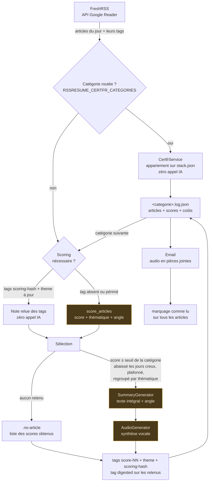
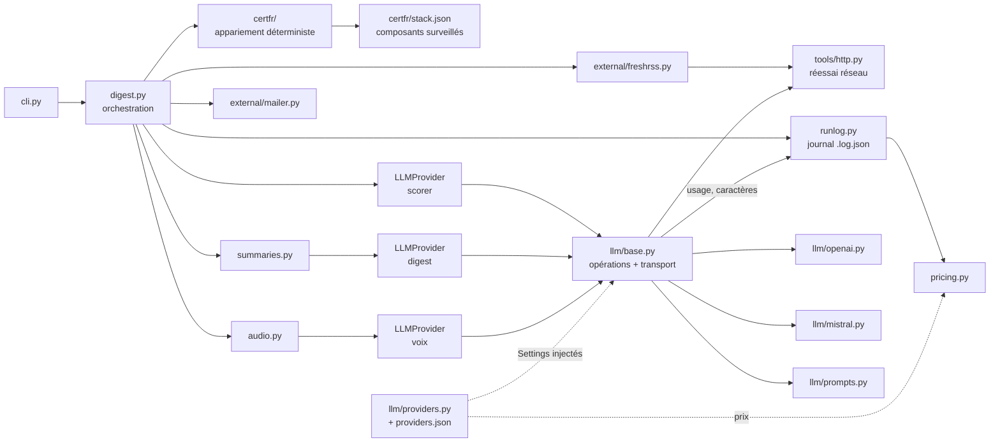

# Fonctionnement de RSSResume

Ce document décrit ce que fait une exécution, dans l'ordre, et pourquoi chaque étape est là.
Pour l'installation et les commandes, voir [README.md](README.md).

## Vue d'ensemble



Les trois blocs ambrés sont les seuls qui appellent l'API payante.

Tout ce qui précède l'email se répète **par catégorie**, tags compris. Seul le marquage comme lu
attend la livraison, une fois toutes les catégories traitées.

## Les étapes

### 1. Sélection des catégories

`RSSRESUME_CATEGORIES` si elle est définie, sinon toutes les catégories découvertes dans FreshRSS,
moins `RSSRESUME_EXCLUDED_CATEGORIES` (comparaison insensible à la casse). Les flux FreshRSS sans
catégorie ne sont jamais traités.

Les étapes 2 à 6 sont ensuite répétées **par catégorie**. Les étapes 7 et 8 n'ont lieu qu'une fois,
après la dernière catégorie.

**Une catégorie peut quitter ce pipeline entièrement.** `RSSRESUME_CERTFR_CATEGORIES` liste celles
qui sont routées vers le traitement déterministe des avis CERT-FR : elles passent de l'étape 2 à
l'étape 6 sans toucher aux étapes 3, 4 ni 5 — ni scoring, ni résumé, ni synthèse vocale. Voir
[Le traitement déterministe des avis CERT-FR](#le-traitement-déterministe-des-avis-cert-fr).

Le choix est fait dans `DigestService._build_digest`, **à l'intérieur** du `runlog.category_scope` :
le journal, le slug et l'écriture du fichier restent les mêmes des deux côtés, seul le contenu de
la catégorie change. C'est ce qui garantit que `--send-only` relit les deux sans le savoir.

### 2. Récupération des articles

**Le tri se fait côté API, pas en Python.** `stream/contents` est appelé avec `ot` — borne basse
de la journée, en secondes — et `xt=user/-/state/com.google/read`, qui écarte les articles déjà
lus. La pagination par 100 reprend ces deux paramètres à chaque page : la continuation dit où
reprendre, pas ce qu'on demandait. Auparavant le flux entier était paginé jusqu'à épuisement avant
d'être découpé en Python : des dizaines d'appels HTTP par catégorie pour en garder vingt.

Le découpage Python subsiste **en filet** : il tient la borne haute de la journée, qui n'a pas de
paramètre équivalent, et il couvre le cas d'un serveur qui ignorerait `ot` — un paramètre inconnu
est ignoré sans erreur, donc le pire cas est de repayer la pagination d'avant, jamais un article
manquant.

**La journée est celle du fuseau configuré**, `RSSRESUME_TIMEZONE`, par défaut `Europe/Paris`.
Les bornes se calculaient en UTC : en heure d'été, un article publié à 1 h du matin à Paris
tombait dans la veille — une journée déjà livrée, dont les articles sont marqués lus. Il
n'apparaissait donc dans aucun digest, et rien ne le signalait. La borne haute est prise au
jour civil suivant et non à vingt-quatre heures, pour que la nuit du changement d'heure fasse
ses vingt-trois ou vingt-cinq heures. La date par défaut de la ligne de commande suit le même
fuseau : l'horloge d'un serveur de cron est souvent en UTC, et « aujourd'hui » n'y est pas le
même après 22 h.

Conséquence sur le rejeu : une journée déjà livrée a ses articles marqués lus, donc l'API ne les
rend plus. La rejouer demande `--include-read`. La mise au point d'un prompt, elle, passe par
`--no-mark-read` et n'est pas concernée.

Chaque article remonte avec ses **tags utilisateur déjà posés** (`Article.tags`) — c'est ce qui
rend le cache de scoring possible à l'étape suivante.

Une catégorie sans article s'arrête ici : un fichier marqueur vide `<categorie>.no-article` est
écrit, et aucun appel IA n'est déclenché.

Le HTML de chaque article est dépouillé dès l'ingestion (`strip_html`), scripts et styles retirés
**avec leur contenu** : voir [Contraintes de sécurité](#contraintes-de-sécurité).

### 3. Scoring

Chaque article reçoit une **note** selon un profil de pertinence unique
([profil.py](rssresume/profil.py)). Le scoring ne voit que le **titre et un extrait de
400 caractères** : c'est une étape de tri, pas de compréhension.

Une note, c'est trois champs — et les trois servent :

| Champ | Ce que c'est | Où il sert |
| --- | --- | --- |
| `score` | 0 à 10 | seuil de sélection, plafond, tag `score-NN` |
| `thematique` | reglementaire, cyber, marche, stack, autre | ordre de lecture du digest, tag `theme-<x>` |
| `angle` | une phrase : en quoi l'article compte pour ce profil | passé au résumeur avec l'article |

Les trois arrivent dans le même appel. Le score seul pilotait tout et les deux autres étaient
jetés : payés puis perdus. L'angle est précisément le contexte qui manquait au résumé — il dit
*pourquoi* l'article est là — et la thématique donne gratuitement le regroupement à l'écoute.

Trois cas par article :

```
article porte scoring-<hash courant> + score-NN + theme-<x>  →  note relue des tags, aucun appel
article porte scoring-<autre hash>                           →  renoté, anciens tags à nettoyer
article sans tag de scoring                                  →  noté
```

Le cache exige le score **et** la thématique : une note partielle rangerait l'article dans le
mauvais groupe, elle est donc traitée comme absente. L'angle, lui, n'est pas mis en tag — une
phrase entière n'a rien à faire dans un label FreshRSS. Un article relu du cache part donc au
résumé sans son angle, et le prompt le prévoit.

Les articles à noter partent par lots de 40 en un appel chacun.

**Un lot incomplet ne fait plus tomber la journée.** Trente-neuf notes sur quarante levaient une
erreur qui tuait la catégorie en cours et toutes les suivantes, alors que le réalignement sait
déjà où sont les trous. L'article oublié ressort donc marqué comme non noté, et il est écarté :
ni note en mémoire, ni tag dans FreshRSS. Ce dernier point est le seul qui compte vraiment —
entrer avec un score de zéro le ferait taguer `score-00` sous l'empreinte courante, donc relire
de ce cache à chaque exécution suivante : un accident de lot deviendrait définitif. Sans tag,
un rejeu de la journée (`--include-read`) le note de nouveau, et le journal de la catégorie le
montre sans note (`origine_note: aucune`). Une réponse dont *rien* n'est exploitable, elle,
reste une erreur : ce n'est plus un trou dans un lot, c'est un lot qui n'a pas été traité.

**Une réponse coupée par le plafond de sortie redécoupe le lot** au lieu d'abandonner. Il n'y a
rien à comprendre à cette panne : la même consigne sur deux fois moins d'articles rend deux fois
moins de JSON. Le lot est donc rejoué en deux moitiés, récursivement, jusqu'à un plancher de 5
articles — en dessous, ce n'est plus la taille qui est en cause, et insister repaierait le même
appel pour la même coupure. Ce rattrapage est propre à la notation : sur le digest, qui n'a pas
de lot à découper, une troncature reste immédiatement fatale.

**Le modèle ne voit jamais les identifiants FreshRSS.** Chaque article part sous un numéro local
de 1 à N, et les notes sont réalignées à l'arrivée. Un identifiant comme
`tag:google.com,2005:reader/item/000659ce0338ac4f` revenait altéré assez souvent pour faire
échouer tout le lot. Si un numéro est malgré tout illisible ou dupliqué, la note est rattachée à
la première place libre — l'ordre de réponse est imposé par le prompt — et un avertissement est
tracé dans les logs.

Sans API configurée, cette étape est sautée : tous les articles passent à l'étape 4.

### 4. Sélection

Articles dont le score atteint le seuil de la catégorie, triés par score décroissant,
plafonnés à `RSSRESUME_MAX_DIGEST_ITEMS` (défaut 12). Les quatre réglages qui décident de tout
cela sont portés ensemble par un `SelectionRule`, résolu une fois par catégorie
(`AppConfig.selection_rule`) : le seuil, son repli, le nombre d'articles qui déclenche le repli,
et le plafond.

**Le seuil, par catégorie.** `RSSRESUME_SCORE_THRESHOLD` (défaut 7) vaut pour toutes les
catégories, et `RSSRESUME_CATEGORY_THRESHOLDS` le surcharge pour certaines, sous la forme
`Catégorie=score`. Toutes les catégories ne se jugent pas au même barème : dans une catégorie
généraliste, presque tout tombe dans la tranche 5-6 du barème — « intéressant à connaître, non
actionnable » — et à 7 elle se vidait tous les jours. Elle est donc réglée à 5, là où un flux
d'avis de sécurité reste à 7. Le nom est comparé casse repliée ; une entrée mal formée fait
échouer le lancement, elle n'est pas ignorée en silence.

**Le repli, les jours creux.** Quand le seuil retient moins de `RSSRESUME_MIN_DIGEST_ITEMS`
articles (défaut 5), il tombe à `RSSRESUME_FALLBACK_THRESHOLD` (défaut 5) pour la journée
entière. Ce n'est pas un remplissage jusqu'au minimum : le seuil baisse pour tout le monde, donc
une journée repliée peut rendre plus de cinq articles — seul le plafond la borne. Une catégorie
déjà à 5 n'a rien à replier, et `RSSRESUME_MIN_DIGEST_ITEMS=0` désactive le mécanisme. Le seuil
réellement appliqué repart avec la sélection, et non recalculé par l'appelant : c'est lui
qu'affiche la console, qu'annonce le marqueur d'une catégorie vide, et qu'écrit le journal sous
`resultat.seuil_applique`.

**Puis regroupés par thématique.** Le plafond s'applique sur le score — c'est lui qui décide qui
entre —, mais l'ordre de lecture, lui, est thématique : le tri par score seul faisait sauter du
réglementaire au cyber, puis au marché, puis de nouveau au réglementaire, ce qui interdit toute
transition à l'oral. L'urgence reste respectée : un groupe est classé sur son meilleur article,
et à l'intérieur d'un groupe l'ordre reste le score décroissant. Le regroupement ne coûte aucun
appel supplémentaire, la thématique étant déjà notée.

C'est cette sélection — et elle seule — qui alimente le résumé **et** qui reçoit le tag `digested`.
Les deux ne peuvent pas diverger : un test le verrouille.

**Sélection vide.** Si aucun article n'atteint le seuil — repli compris —, la catégorie s'arrête ici, comme une
catégorie sans article : ni résumé ni synthèse vocale — l'audio n'aurait rien à dire. Le marqueur
`<categorie>.no-article` est écrit, mais avec la liste des scores obtenus :

```
Aucun article retenu sur 3 (seuil 7).

 5/10 stack         - Un nouveau format d'archive open source
 4/10 marche        - Bilan trimestriel d'un fournisseur cloud américain
 1/10 autre         - Test d'un casque audio sans fil
```

C'est ce qui permet de juger un seuil trop haut sans rouvrir FreshRSS. Les tags de scoring, eux,
sont écrits normalement (étape 6) : sans cela un lot entièrement sous le seuil serait renoté à
chaque passage.

### 5. Résumé et audio

Le résumé reçoit le **texte** des articles retenus — plafonné à `RSSRESUME_ARTICLE_CHAR_LIMIT`
caractères par article, 8000 par défaut, et coupé à la dernière phrase entière plutôt qu'au
caractère : une phrase laissée en l'air, un modèle la termine tout seul, c'est-à-dire l'invente.
C'était le seul chemin du pipeline sans borne d'entrée, quand le scoring n'a jamais lu que 400
caractères : douze articles de fond faisaient facilement cent mille caractères. Le plafond est
posé au-dessus des 6000 caractères que `tools/cve.py` lit sur la page d'un avis, pour qu'un avis
enrichi passe entier — c'est là que sont les versions touchées. Le volume réellement envoyé est
affiché par catégorie dans le suivi d'exécution. Chaque article est accompagné de
sa thématique et de son `angle` — la phrase du scoring qui dit en quoi l'article compte pour ce
profil. C'est l'angle à prendre, pas une phrase à recopier, et il ne coûte rien : il est produit par
l'appel de scoring, qui a déjà eu lieu.

Le texte est écrit pour être **écouté**, pas lu, ce qui dicte six contraintes :

- **prose continue** : des phrases enchaînées avec des transitions, jamais de puces ni de
  « premièrement, deuxièmement » — une énumération à l'oral ne s'écoute pas ;
- **rythme** : alternance de phrases courtes et longues, phrases coupées au-delà d'une trentaine
  de mots, ni parenthèses ni incises ni relatives empilées, débuts de phrase variés, information
  qui compte en fin de phrase. C'est ici que se règle une voix plate, pas dans les consignes de
  diction : le TTS ne peut rythmer que ce que la phrase lui donne à rythmer ;
- **ni lien ni média** : ni l'URL ni le nom du flux n'entrent dans le prompt. Ce qui n'est pas
  dans le contexte ne peut pas ressortir dans le texte lu à voix haute — et une URL vue par le
  modèle est une URL qu'il peut recopier de travers. Qui a publié n'intéresse pas l'auditeur, et
  « … (CERT-FR, LeMagIT) » toutes les trois phrases hachait le texte à l'écoute. Une organisation
  qui *agit* dans le fait — l'ANSSI qui publie un avis, la CNIL qui sanctionne — reste nommée :
  c'est le sujet de la phrase, pas une attribution. Les liens et les sources partent dans
  l'email (étape 7), où ils se lisent au lieu de s'entendre ;
- **une ouverture et une clôture jugées sur la journée** : une phrase courte en tête, qui dit
  combien il y a à dire et ce qui en fait le poids — urgence, gravité, originalité, ou journée
  creuse — et une phrase courte en fin, qui découle des sujets du jour : ce qu'il reste à faire,
  ce qui est à suivre demain, ou qu'il n'y a rien à faire. Les deux s'adressent à **une seule
  personne**, celle du profil. Aucun gabarit ne convient : ces deux phrases sont un jugement sur
  la sélection du jour, elles changent tous les jours. La conclusion passe-partout sur
  l'importance de la sécurité reste explicitement interdite, « bonne journée » seul aussi ;
- **longueur proportionnée au volume**, sans quoi le même texte servirait pour 3 comme pour 30
  articles :

| Articles retenus | Profondeur demandée |
| --- | --- |
| ≤ 3 | deux à trois phrases par sujet |
| ≤ 8 | une à deux phrases par sujet |
| > 8 | une phrase par sujet, les sujets proches fondus ensemble |

Les articles arrivent dans l'ordre de lecture décidé à l'étape 4, regroupés par thématique. Le
prompt demande de garder cet ordre et de marquer le passage d'une thématique à la suivante par une
transition courte — sans annoncer de rubrique, ce qui reviendrait à réintroduire une liste.

**Fusion des doublons.** Un même événement est souvent couvert par plusieurs flux : trois dépêches
sur le même incident produisaient trois passages, dont deux redites que l'auditeur subit sans pouvoir
sauter. Le prompt impose donc de traiter ces articles comme **un seul sujet** — le fait dit une seule
fois et ce que chaque dépêche apporte de plus gardé au même endroit — et les paliers de longueur
ci-dessus se comptent en sujets après fusion, pas en articles reçus.

**Le cas des CVE.** Les vulnérabilités sortent du régime commun : **une CVE est un sujet à elle
seule**, jamais fondue avec une autre — même jour, même source et même produit n'y changent rien —
et les paliers de longueur ne s'y appliquent pas. Chacune se dit en une à deux phrases factuelles,
dans un ordre fixe : identifiant, produit et versions, ce que la faille permet, exploitée ou non,
ce qu'il y a à faire. Le **nom commercial exact** de l'éditeur et du produit — « FortiOS », pas
« le pare-feu » ; « VMware vCenter Server », pas « l'hyperviseur » — et les **numéros de version**,
plage touchée *et* version corrigée, passent avant tout le reste : c'est là-dessus, et seulement
là-dessus, que l'auditeur décide s'il est concerné. Quand l'avis ne les donne pas, le prompt demande
de le dire en trois mots plutôt que de les deviner — une version inventée sur un avis de sécurité
est pire que l'absence d'information. C'est le seul endroit du digest où la précision passe avant le
style : les règles de prose, de fusion et de longueur diluaient exactement ce qui rend un avis utile.

Un avis de vulnérabilité arrive souvent réduit à son titre :
« CVE-2026-1234 : élévation de privilèges dans le composant X ». Résumer cela ne dit ni ce qui est
touché, ni s'il faut agir — le modèle ne peut que paraphraser le titre. Avant le résumé, la page de
l'avis est donc lue (`tools/cve.py`) et son texte ajouté au contenu de l'article, ce qui permet de dire en
deux phrases le produit et les versions concernés, ce que la faille permet, si elle est exploitée et
ce qu'il y a à faire.

La lecture est ciblée pour ne pas coûter cher : uniquement les articles qui mentionnent une CVE
**et** dont le flux fournit moins de 1200 caractères — au-delà, le détail est déjà là. Le texte
extrait est plafonné à 6000 caractères (au-delà, on paierait des tokens pour des menus et des pieds
de page) et les blocs `<script>`/`<style>` sont retirés avant les balises. Une page injoignable
n'est pas bloquante : l'article repart tel quel, le digest du jour se fait quand même.

Le texte produit part ensuite en synthèse vocale (fournisseur configuré — OpenAI ou Mistral —,
sinon `espeak` en local). Chez OpenAI, les `instructions` du bloc `tts` de `providers.json`
dirigent la diction — ton, débit, émotion, prononciation ; chez Mistral, tout se joue dans
le choix de la voix.
Ces consignes ne sont **pas** envoyées quand la variable est vide : les modèles de synthèse plus
anciens, `tts-1` en tête, rejettent les paramètres qu'ils ne connaissent pas.

Ce qu'on y écrit compte plus qu'il n'y paraît. Une consigne du genre « ton neutre, débit régulier »
donne exactement ce qu'elle demande : une voix plate, sans relief d'une phrase à l'autre. Ce qui
fonctionne, dans l'ordre d'importance :

1. **nommer la situation d'écoute** — une personne, en tête à tête, pas un journal télévisé : c'est
   ce qui change le registre en entier ;
2. **demander explicitement la variation d'intonation**, et interdire de réciter ;
3. **dicter la prononciation** des sigles (A.N.S.S.I. lettre à lettre), des identifiants de CVE et
   des numéros de version — sinon `CVE-2026-1234` est lu « tiret » compris et `7.4.5` avalé ;
4. **placer les pauses** : au changement de sujet, autour d'un numéro de version, et de part et
   d'autre des phrases d'ouverture et de fin.

Le reste du rythme n'est pas réglable ici : il vient de la phrase écrite (voir plus haut). Un texte
fait d'incises et de compléments empilés sera monotone quelle que soit la consigne de diction.
L'exemple complet est dans [.env.example](.env.example).

### 6. Tags de la catégorie

Dès que le résumé de la catégorie est produit, ses tags sont écrits : nettoyage des tags périmés,
`score-NN`, `theme-<thematique>`, `scoring-<hash>`, puis `digested` sur les retenus.

**Pourquoi ici et pas à la fin.** Ce sont des données de cache et de navigation, pas un accusé de
livraison. Les écrire au fil de l'eau garantit qu'une panne à la 5ᵉ catégorie ne fait pas perdre le
scoring des quatre premières — sans quoi il serait intégralement repayé au passage suivant. Deux
tests couvrent ce cas : un échec SMTP et une panne d'API en cours de route laissent les tags déjà
écrits en place.

Contrepartie : un échec d'écriture FreshRSS interrompt l'exécution **avant** l'email, alors qu'il
survenait après auparavant. Une instance FreshRSS injoignable fait donc perdre l'email du jour.

### 7. Email

Un seul email pour toutes les catégories, les fichiers audio en pièces jointes. Sans `SMTP_HOST`
ni `SMTP_TO`, l'étape est sautée sans erreur.

La composition vit dans `newsletter.py` — `Lettre.compose(jour, digests, éphéméride)` — et non
dans `digest.py`. Elle sert deux chemins : la journée qu'on vient de produire, et celle qu'on
renvoie de ses journaux (`--send-only`). Deux façons d'écrire le même email finissaient par ne
plus dire pareil.

**Deux rendus, un seul message.** Le HTML porte la mise en page, le texte reste la version qu'un
client en texte seul saura afficher. Les deux partent dans le même `multipart/alternative`, avec
les audios en `multipart/mixed` par-dessus.

```
Veille du 27 août 2026                        <- titre : la journée RACONTÉE
2 catégories · 21 min d'écoute                <- sous-titre
[Cyber · 5 min] [Réglementaire · 3 min]       <- le détail, en pastilles et en info-bulle
Vendredi 28 août 2026, saint Augustin. 1988…  <- introduction : le jour de l'ENVOI

┌ Cybersécurité technique          [5 min] ┐
│ Une faille touche Traefik, corrigée…     │  <- « Traefik » est cliquable (HTML)
│ À LIRE                                   │  <- les articles retenus
│ • Avis du CERT-FR sur une RCE — CERT-FR  │
│ À SURVEILLER                             │  <- les notés 4 à 6, non retenus
│ • Rapport de tendances — Le Monde Info.  │
│ Pièce jointe : 2-cybersecurite.mp3       │  <- quel mp3 va avec cette section
└──────────────────────────────────────────┘

2 catégories · 12 articles retenus · 17 à surveiller
1 résumé audio en pièce jointe. Composée le 30/08/2026 à 07:30.
```

**Les liens sont posés dans le texte, en HTML** (`ancres.py`). Pour chaque article retenu, on
cherche dans le résumé le groupe de mots le plus distinctif de son titre — un nom propre, un
identifiant de vulnérabilité — et on le rend cliquable là où le résumé en parle. « Une faille
critique touche **Traefik** » mène à l'avis du CERT-FR sans qu'on ait à descendre jusqu'à la liste.

Rien n'est demandé au modèle et **le texte du résumé n'est pas modifié d'un caractère** : c'est un
appariement fait après coup, sur ce qui est déjà écrit. La synthèse vocale lit donc exactement le
même texte, et l'URL vient de la sélection — un lien mal placé reste un lien juste.

Trois garde-fous, parce qu'un lien qui mène au mauvais article est pire que pas de lien :

- les mots banals sont écartés (début de phrase en français, casse de titre en anglais) ;
- les sigles du domaine aussi — `RCE`, `CVE`, `DDoS` nomment une classe de problème, jamais un
  article. Un identifiant complet comme `CVE-2021-44228`, lui, est la meilleure ancre qui soit ;
- l'ancre la plus longue l'emporte, et le placement se fait sur le résumé **entier** : un article
  dont le premier paragraphe ne dit qu'un mot vague et le troisième le nom propre s'ancre sur le
  nom propre.

L'appariement est au mieux, jamais garanti — un article dont le résumé ne reprend aucun nom propre
ne s'ancre nulle part. C'est pourquoi les listes restent sous le texte : elles, ne ratent personne.
Seuls les articles **retenus** sont ancrés ; ceux de la liste de veille n'ont pas été racontés,
donc n'ont aucun mot à quoi s'accrocher.

**Les liens sont dans l'email, et seulement là.** L'audio n'a pas de liens — une URL lue à voix haute est
inutilisable —, l'email en a, parce que c'est le seul endroit où retrouver l'article derrière un
sujet entendu. Les deux listes viennent de `CategoryDigest.links` et `.watchlist_links`,
**dérivées de la sélection et des scores**, et non d'un texte produit par le modèle : elles ne
peuvent donc pas être hallucinées. Une liste vide n'ajoute aucun en-tête.

**La liste « à surveiller »** est la bande des scores 4 à 6 non retenus (`WATCHLIST_MIN` et
`WATCHLIST_MAX`, dans `models.py`). Ces articles sont déjà payés — lus, notés, écartés — et les
taire revenait à jeter la moitié de ce qu'une journée coûte. Ils n'entrent pas dans l'audio pour
autant : un titre et un lien, rien de plus. C'est dans une catégorie sans aucun retenu qu'ils
servent le plus.

**Chaque section nomme son fichier audio.** Le message porte un mp3 par catégorie, tous dans le
même bandeau de pièces jointes, et rien ne disait lequel allait avec quoi — il fallait rapprocher
un slug d'un titre de catégorie soi-même. Le nom seul, jamais un lien : aucun client mail n'ouvre
une pièce jointe depuis le corps du message (`cid:` sert à incorporer une image, pas à déclencher
une ouverture), et un lien inerte se lit comme un lien cassé.

**Le temps d'écoute** est mesuré sur le fichier audio, pas estimé depuis le texte
(`tools/duration.py` : en-tête `wave` pour le `.wav`, parcours des trames pour le `.mp3`). Une
durée qu'on n'a pas su lire ne s'affiche pas — `None` et non « 0 min ».

**Deux dates, et elles ne sont pas interchangeables.** Le titre et l'objet nomment la journée que
la lettre RACONTE ; l'introduction ouvre sur le jour de l'ENVOI. Les deux diffèrent tous les
matins, puisque le passage de 7 h résume la veille (`RSSRESUME_SCHEDULE_DAYS_BACK`) : ouvrir sur la
date du digest faisait arriver dans la boîte une lettre datée de l'avant-veille.

**L'éphéméride** porte donc sur le jour de l'envoi. Elle est faite de deux morceaux :

- **la fête**, tirée de `ephemeride/fetes.py` — une table fixe de 366 entrées, le calendrier des postes. Une
  donnée qui ne bouge pas d'une année sur l'autre n'a rien à faire dans un prompt : elle ne coûte
  rien, ne peut pas être inventée, et rend la même chose au renvoi qu'à l'envoi. Elle est écrite en
  apposition — « Vendredi 28 août 2026, saint Augustin. » —, tournure qui marche aussi bien pour un
  saint que pour la Toussaint ou Noël. Corriger une date se fait dans `FETES`, et nulle part ailleurs. Le paquet `ephemeride/` sépare
  d'ailleurs les données du procédé pour cette raison : `fetes` et `histoire` sont des tables qu'on
  corrige souvent, `service` est le procédé qu'on relit rarement ;
- **le fait historique**, qui descend trois marches : le modèle (`ephemeride` dans `providers.json`,
  un appel par journée), puis la table de `ephemeride/histoire.py`, puis le calendrier, qui ne peut
  pas échouer. Le modèle répond `AUCUN` plutôt que de combler quand il ne sait rien de cette date.

Celle qui a servi est écrite dans `output/<jour>/journee.json`, **avec le jour qu'elle décrit**.
`--send-only` la réutilise si elle parle bien du jour du renvoi — le cas courant, quand l'envoi a
échoué le matin et qu'on relance une heure plus tard. Renvoyée trois jours plus tard, elle daterait
la lettre du mauvais jour et annoncerait la fête d'un autre : elle est alors recalculée sur la
table et le calendrier, sans aucun appel, comme le promet `--send-only`.

### 8. Marquage comme lu

**Après l'envoi uniquement**, et sur **tous** les articles récupérés, pas seulement les retenus. Un
échec d'email les laisse non lus : le passage suivant les reprend, et le cache de scoring fait qu'il
ne repaie rien.

## Le traitement déterministe des avis CERT-FR

Le flux « CERT-FR - Avis de securite » publie cinq à dix articles par jour, tous bâtis sur le même
moule : un titre « Multiples vulnérabilités dans *X* (JJ mois AAAA) » et une description d'une
phrase, qui nomme ce que la faille permet. Rien d'autre — l'enrichissement de `tools/cve.py` ne s'y
déclenche même pas, la description ne mentionnant aucun identifiant de CVE.

Ce format-là ne demande pas un résumé, il demande une **réponse** : est-ce que ça touche ma stack.
Le faire passer par le pipeline LLM revenait à payer un scoring puis un résumé pour faire
reformuler un formulaire, et à écouter tous les matins sept paragraphes qui commencent pareil.

```bash
RSSRESUME_CERTFR_CATEGORIES=1 - Alertes et avis CERT-FR ANSSI
```

La catégorie ainsi routée saute les étapes 3, 4 et 5 et rend une phrase, une seule :

```
7 avis CERT-FR aujourd'hui, 2 touchent la stack :
  Keycloak — exécution de code arbitraire à distance ; OpenSSL — déni de service à distance.
```

**Le routage est explicite.** Aucune catégorie n'y tombe parce qu'elle s'appelle CERT-FR : rien ne
doit changer de pipeline parce que quelqu'un a renommé un dossier FreshRSS. Le libellé est comparé
casse repliée **et accents retirés** (`tools/text.casefold_ascii`), là où `RSSRESUME_EXCLUDED_CATEGORIES`
ne replie que la casse. Ce n'est pas une préférence : le libellé réel porte des accents, un
copier-coller vers un panneau d'hébergeur les perd régulièrement — `RSSRESUME_CATEGORY_THRESHOLDS`
en est déjà un exemple dans cette installation —, et une catégorie qu'on croit routée et qui ne
l'est pas ne fait pas d'erreur : elle repasse par le LLM, tous les matins, en silence. Une entrée
écrite comme un seuil (« Catégorie=7 ») fait échouer le lancement, pour la même raison qu'un seuil
mal formé.

### Ce que la catégorie rend

| Champ du `CategoryDigest` | Contenu | Ce qui en découle |
| --- | --- | --- |
| `articles` | **tous** les avis du jour | `_mark_read` les aplatit : les avis qui ne nous touchent pas sont marqués lus sans être résumés, sans une ligne de code de plus |
| `selected` | les avis qui touchent la stack, les plus graves en tête | la liste « À lire » de l'email, dérivée par `CategoryDigest.links` |
| `summary_text` | la phrase | le corps de la section, et le `resume` du journal |
| `audio_path` | `None` | aucun appel TTS, aucune pièce jointe, aucun badge de durée — `newsletter.py` traitait déjà ce cas |

Aucun tag FreshRSS n'est écrit : il n'y a ni note à mettre en cache, ni empreinte de prompt à
retenir.

### L'appariement

Le titre **et** la description, sur la liste de [certfr/stack.json](rssresume/certfr/stack.json) :
le titre nomme le produit dans la quasi-totalité des avis, mais « Multiples vulnérabilités dans les
produits IBM » ne nomme le composant réellement touché que dans son texte.

La comparaison porte sur des **suites de mots contigus**, casse et accents retirés, et jamais sur la
chaîne. C'est ce qui distingue un appariement d'un `in` : chercher « Go » dans « Google Chrome »
réussit sur la chaîne et se trompe sur le produit. Un composant qui ressort tous les jours parce que
son nom est court rend la phrase entière inutile en trois matins. Corollaire dans l'autre sens :
« Apache Tomcat » ne se reconnaît pas dans un avis qui cite Apache d'un côté et Tomcat de l'autre.

La liste est livrée **vide** : ses entrées d'exemple sont dans un bloc `_exemples` que la lecture
ignore, comme toute clé préfixée d'un `_`. Un exemple qui apparierait un vrai avis serait un faux
positif livré par défaut, le jour de l'installation. Tant qu'elle est vide, la phrase le dit :

```
5 avis CERT-FR aujourd'hui, sans appariement : aucun composant n'est déclaré dans la liste de la stack.
```

`RSSRESUME_STACK_FILE` désigne un fichier fusionné par-dessus, clé à clé — la vraie liste hors du
dépôt, et le seul moyen de la changer en conteneur sans rebuild. Un fichier annoncé mais illisible
ou vide **fait échouer le lancement** : retomber en silence sur la liste livrée ferait apparier une
journée entière contre une stack qui n'est pas celle qu'on croit, et le digest conclurait
tranquillement que rien ne nous touche. Même arbitrage que le fichier de profil.

### La criticité, et d'où elle sort

Un avis CERT-FR ne porte **ni score CVSS ni cotation de gravité** — sa page liste les CVE, pas leurs
scores. Ce qu'il porte, c'est la liste de ce que la faille permet, dans un vocabulaire fixe :
« De multiples vulnérabilités ont été découvertes dans SPIP. Certaines d'entre elles permettent à un
attaquant de provoquer une exécution de code arbitraire à distance, une injection SQL (SQLi) et une
falsification de requêtes côté serveur (SSRF). »

C'est ce vocabulaire, et lui seul, que `certfr/service.py` reconnaît, dans un ordre de gravité qui
est un classement **local** — celui de l'exploitant, prendre la main devant la couper :

```
exécution de code arbitraire à distance
exécution de code arbitraire
élévation de privilèges
contournement de la politique de sécurité / de l'authentification / de la fonctionnalité de sécurité
injection de code indirecte à distance / injection SQL / falsification de requêtes côté serveur
atteinte à l'intégrité des données
atteinte à la confidentialité des données
déni de service à distance
déni de service
```

L'ordre fait tout le travail : la reconnaissance s'arrête au premier libellé qui répond, et
« exécution de code arbitraire à distance » est cherché avant « exécution de code arbitraire », dont
il contient les mots. Le libellé cherché est aussi celui qui s'écrit dans la phrase — un seul texte
pour les deux, sans quoi elle finirait par nommer autre chose que ce qui a été reconnu.

Quand rien n'est reconnu — un bulletin d'actualité, un avis « à l'impact non spécifié par
l'éditeur » —, la phrase le dit : *impact non précisé par l'avis*. Un champ vide se lirait comme une
faille bénigne. Rien n'est déduit et rien n'est complété : sur un avis de sécurité, une information
fabriquée est pire que pas d'information.

### Ce que le journal en garde

Le fichier reste `<categorie>.log.json`, au même endroit, mais son bloc `parametres` est différent :
`seuil`, `seuil_repli` et `empreinte_scoring` n'ont aucun sens sans scoring, et les écrire à zéro
ferait lire ce journal comme celui d'une catégorie qui n'a rien retenu.

```json
"parametres": {
  "traitement": "certfr",
  "langue": "fr",
  "composants": 12,
  "empreinte_stack": "3f9a2c81b4de"
},
"resultat": { "statut": "deterministe", "articles": 7, "retenus": 2, "audio": null },
"couts": { "devise": "USD", "total": 0.0, "appels": [] }
```

`empreinte_stack` est le pendant de `empreinte_scoring` : deux journaux dont elle diffère n'ont pas
été appariés contre la même liste, et une journée qui ne signalait rien s'explique sans avoir à
retrouver le fichier de l'époque. `couts.total` à `0.0` avec `appels` vide n'est pas une remontée
partielle, c'est le signal recherché.

`"statut": "deterministe"` est une valeur à part, et testée avant les autres : une catégorie
déterministe n'a jamais d'audio et n'a pas toujours d'apparié, ce qui la ferait passer pour une
catégorie que le seuil a vidée. Ce n'est pas la même journée — ici rien n'a été jugé, tout a été
comparé — et `retenus`, juste à côté, dit combien d'avis touchaient la stack.

**`--send-only` relit ce journal sans traitement particulier**, et c'est cette contrainte qui a
dicté sa forme : même suffixe de fichier, un `resume`, et `retenu` + `rang_digest` sur les avis
appariés — sans eux, le renvoi arriverait avec une section vide de tout lien. Le `score` reste à
`null` : `_a_surveiller` exige un entier dans la fourchette 4-6, donc aucun avis ne peut entrer par
accident dans la liste « à surveiller ».

### Ce que l'appariement ne saura pas faire

- un composant que l'avis désigne autrement que par une écriture déclarée est manqué — c'est le prix
  du déterminisme, et la raison d'être des `alias` ;
- un avis ne nomme parfois que l'éditeur (« les produits IBM ») quand le composant touché n'est
  détaillé que sur la page de l'avis, que ce chemin ne lit pas ;
- la criticité vaut pour l'avis entier, pas pour le composant : un avis qui liste une RCE sur un
  module et un déni de service sur un autre est annoncé à la RCE.

Dans tous les cas, les avis restent liés dans l'email et lisibles en un clic. Le tri déterministe
range et hiérarchise, il ne remplace pas la lecture de l'avis.

## Le journal d'une catégorie

Écrit à la fermeture de chaque catégorie, **avant** l'email et le marquage comme lu, à côté de son
audio : `output/<jour>/<categorie>.log.json`.

Il fixe ce qu'une exécution finie ne conservait nulle part :

| Bloc | Contenu | Ce qu'il permet |
| --- | --- | --- |
| `articles` | tous les articles lus, les mieux notés en tête : score, thématique, `angle`, `retenu`, `rang_digest`, et `origine_note` (`calculee`, `tags`, `aucune`) | juger un seuil, voir ce qui est passé juste à côté, retrouver l'angle qu'a vu le résumeur |
| `couts` | le coût par typologie d'appel — `scoring`, `resume`, `tts` — puis appel par appel | savoir où part l'argent, avant de changer de modèle |
| `parametres`, `resultat` | seuil de la catégorie, seuil de repli, minimum, plafond, modèles, empreinte de scoring ; statut, compteurs, `seuil_applique` (le seuil qui a réellement trié la journée), fichier produit | savoir contre quels réglages ce journal a été produit, et si le repli a joué |

**Quand il est écrit.** Toute catégorie qui a lu au moins un article a le sien : avec audio, sans
sélection, et même après une erreur en cours de route (`"statut": "interrompu"`), qui est justement
le cas où il sert le plus. Une catégorie **sans aucun article**, elle, n'en a pas : elle n'a rien
lu, rien noté, rien dépensé, et le journal ne dirait que des zéros là où son marqueur
`.no-article` dit déjà tout.

Une catégorie routée hors du pipeline LLM écrit le même fichier avec un `parametres` et un `statut`
qui lui sont propres : voir [Ce que le journal en garde](#ce-que-le-journal-en-garde).

### Comment le coût est rattaché à une catégorie

Les appels partent du fond d'un `LLMProvider`, qui n'a aucune raison de savoir quelle catégorie est en
cours — et lui faire passer la catégorie polluerait la signature de toute la chaîne. `digest.py`
ouvre donc un `runlog.category_scope` autour de la construction de chaque catégorie, et `LLMProvider`
y dépose ce qu'il apprend : le bloc `usage` d'une complétion, le texte envoyé pour une synthèse.
Le pipeline est séquentiel — une catégorie à la fois —, ce qui rend cet état de module suffisant.
Hors de tout scope (par exemple `python -m rssresume.llm.processing`), l'enregistrement est un no-op.

### Les trois postes de dépense

Les quatre actions d'un `LLMProvider` se rangent sous trois postes :

| Poste | Actions | Facturé sur | Nombre d'appels |
| --- | --- | --- | --- |
| `scoring` | `scoring` | tokens d'entrée + de sortie | un par lot de 40 articles **à noter** |
| `resume` | `digest`, `article` | tokens d'entrée + de sortie | un seul pour toute la catégorie |
| `tts` | `tts` | caractères ou tokens d'entrée, selon le modèle | un seul pour toute la catégorie |

**Un appel par poste n'est donc pas une remontée partielle** : c'est le fonctionnement nominal.
Le scoring envoie ses articles par lots de 40 (`llm.prompts.SCORING_BATCH_SIZE`), et n'y met que
ceux dont la note n'a pas été relue des tags — une catégorie de 19 articles tient en un appel, une
catégorie de 19 articles tous déjà notés n'en fait aucun. Le digest et la synthèse vocale, eux,
voient toute la sélection d'un coup : un appel chacun, quel que soit le nombre d'articles retenus.
`article` n'apparaît que pour un appel direct à `summarize_article`, hors pipeline quotidien.

`tokens_raisonnement` est isolé bien qu'inclus dans les tokens de sortie : sur un modèle raisonnant,
c'est lui, et non la longueur du texte rendu, qui explique la facture du digest.

### Les prix, et ce qu'ils valent

La conversion tokens → dollars vient d'une grille statique dans
[llm/providers.json](rssresume/llm/providers.json), bloc `prices` de chaque fournisseur, lue par
[pricing.py](rssresume/pricing.py) — donc datée, donc à revérifier : un tarif périmé s'y lit comme
un coût réel. Deux formes de tarif cohabitent, jamais mélangées : `{"input", "output"}` en dollars
par million de tokens, `{"characters"}` en dollars par million de caractères.

Un nom de modèle suivi d'un **instantané daté** (`gpt-4o-mini-2024-07-18`, `-0613`) retombe sur sa
famille : lister toutes les dates de publication serait intenable, et elles ne changent pas le prix.
Un suffixe qui n'est pas une date, en revanche, n'est jamais rattaché, même quand le nom commence
par un modèle connu : `gpt-5.6-luna` commence par `gpt-5` sans être `gpt-5`, et le facturer au tarif
de `gpt-5` rendrait un coût faux **et vraisemblable**, que rien ne signalerait.

Deux garde-fous :

- **Un modèle inconnu ne coûte pas zéro.** Son coût est rendu à `null`, son nom apparaît dans
  `modeles_sans_tarif`, et `tarification_complete` passe à `false`. Le total de son poste et le
  total général passent à `null` avec lui : pas de somme partielle, parce qu'un total amputé se
  lit exactement comme un total complet, et que c'est un chiffre que quelqu'un reportera un jour
  dans un tableur. Un poste sans le moindre appel, lui, vaut bien `0.0` — rien dépensé et coût
  inconnu ne se lisent pas pareil. `RSSRESUME_PRICES`, un objet JSON du même format, complète la
  grille sans toucher au code ; un JSON cassé y est ignoré plutôt que de faire échouer la veille.
- **Le coût de la synthèse vocale est parfois estimé.** L'API ne renvoie aucun compteur : le texte
  envoyé est la seule assiette. Au caractère (`tts-1`), le compte est exact ; au token
  (`gpt-4o-mini-tts`), il est déduit du texte à quatre caractères par token, et l'appel porte
  `"cout_estime": true`.

## Le profil de pertinence

Un seul texte, dans [profil.py](rssresume/profil.py), utilisé par les **trois** prompts : noter,
résumer un article, dicter le digest audio. C'est lui qui définit ce qu'est une information pour
cet auditeur — le reste du système n'est que de la plomberie autour.

Il est donc **injectable de l'extérieur**, dans cet ordre de priorité :

| Source | Usage |
| --- | --- |
| argument explicite (`score_articles(..., profil=…)`, `AppConfig.profil`) | appel programmatique, tests |
| `RSSRESUME_PROFILE` | un profil court, en clair |
| `RSSRESUME_PROFILE_FILE` | un profil long, ou versionné à part du dépôt |
| `DEFAULT_PROFIL` | le profil par défaut du dépôt |

Trois conséquences de conception :

- **Les prompts sont assemblés à l'appel, pas figés à l'import.** `processing.scoring_system()` et
  `summaries.system_prompt()` sont des fonctions, non des constantes : un profil injecté doit
  pouvoir arriver après le chargement des modules.
- **L'assemblage est une concaténation, jamais un `format`.** Le prompt de scoring contient des
  accolades — le format JSON attendu — et un profil venu de l'extérieur peut en contenir aussi.
- **Un fichier de profil illisible lève une erreur.** Retomber en silence sur le profil par défaut
  ferait noter toute une journée contre le mauvais critère sans que personne ne le voie.

Le profil de l'application est résolu **une fois**, dans `AppConfig.from_env()` : un chemin de
fichier fautif fait échouer le lancement, pas la troisième catégorie.

## Le cache de scoring

L'empreinte est un SHA-256 tronqué de `SCORING_SYSTEM` **et du modèle de scoring**. Elle est posée
sur l'article en même temps que sa note.

```
                    PROFIL + barème + modèle
                              │
                         sha256[:12]
                              │
                    scoring-508f38b6e31b
                              │
        ┌─────────────────────┴─────────────────────┐
        │                                           │
  identique au tag                          différente du tag
  porté par l'article                       porté par l'article
        │                                           │
  score relu, gratuit                    anciens tags retirés,
                                          article renoté
```

Conséquence pratique : tant que tu ne touches ni au profil, ni au barème, ni au modèle, relancer la
même journée ne coûte **rien** en scoring — à condition de la redemander avec `--include-read` si
elle a déjà été marquée lue. Le profil entrant dans l'empreinte, en injecter un autre
renote automatiquement : aucun score calculé contre l'ancien profil ne peut survivre. Dès que tu modifies l'un des trois, l'empreinte change et
les articles concernés sont renotés automatiquement — sans que tu aies à purger quoi que ce soit.

Le nettoyage ne balaie pas les onze valeurs possibles : seuls les tags réellement portés par les
articles concernés sont retirés, ce qui donne un appel par tag distinct. Le tag `digested` n'est
jamais touché par ce nettoyage.

## Les tags posés dans FreshRSS

| Tag | Posé sur | Sert à |
| --- | --- | --- |
| `score-00` … `score-10` | tout article noté | filtrer et trier dans FreshRSS ; relu comme cache |
| `theme-<thematique>` | tout article noté | regrouper le digest à l'écoute ; relu comme cache |
| `scoring-<hash>` | tout article noté | savoir quelle version du prompt a produit la note |
| `digested` | les articles retenus | retrouver ce qui a réellement alimenté le résumé du jour |

Le zéro initial de `score-NN` garde l'ordre alphabétique de la liste des tags FreshRSS cohérent avec
l'ordre numérique. `digested` est posé mais jamais relu par le code : reposer un tag existant est
sans effet côté API, donc relancer la même journée est idempotent.

L'`angle` de la note n'a pas de tag : il ne vaut que pour l'exécution qui l'a produit et sert
immédiatement, au résumé. Le mettre en label ferait une phrase entière dans la liste des tags.

## Les appels à l'IA

Un **fournisseur est un objet**. Il reçoit ses réglages au constructeur et sait faire
quatre choses :

```python
provider.score_articles(articles, profil)      # -> [{id, score, thematique, angle}]
provider.summarize_article(article, profil)    # -> str
provider.write_digest(category, articles, …)   # -> str
provider.speak(text)                           # -> bytes
```

C'est tout ce que le reste du projet appelle : jamais un endpoint, jamais un payload.
`DigestService` reçoit ces objets en collaborateurs, comme il reçoit déjà son client
FreshRSS et son expéditeur d'email — et `None` là où la clé manque, ce qui fait
retomber le résumé sur l'extractif local et la voix sur `espeak`.

### Où vit quoi

| | |
| --- | --- |
| [llm/providers.json](rssresume/llm/providers.json) | les **valeurs** : endpoint, modèle et réglages par action, voix, format, tarifs. Aucun code, aucun secret. |
| [llm/providers.py](rssresume/llm/providers.py) | la **lecture** de ces valeurs, et le choix du fournisseur par action. Rend un `Settings`, un objet de valeurs sans comportement. |
| [llm/prompts.py](rssresume/llm/prompts.py) | les **prompts**. Le même texte part chez tous les fournisseurs. |
| [llm/base.py](rssresume/llm/base.py) | `LLMProvider` : les quatre opérations, le transport, la comptabilité — tout ce qui ne dépend pas du fournisseur. Et la fabrique. |
| [llm/openai.py](rssresume/llm/openai.py) · [llm/mistral.py](rssresume/llm/mistral.py) | ce qui diffère **vraiment** : quatre méthodes courtes chacune. |

Une sous-classe ne redéfinit que `chat_payload`, `read_chat`, `speech_payload` et
`read_speech`. Découper le lot de notation, assembler les prompts, réaligner les notes,
enregistrer le coût : tout cela est écrit une fois, dans la classe de base. Un troisième
fournisseur, c'est un fichier de plus et un bloc dans `providers.json`.

Dans l'environnement il ne reste que les secrets et l'aiguillage :
`OPENAI_API_KEY`, `MISTRAL_API_KEY`, `RSSRESUME_PROVIDER`, `RSSRESUME_<ACTION>_PROVIDER`.
Chaque action résout **sa** clé : sans `MISTRAL_API_KEY`, une action confiée à Mistral
retombe sur le local plutôt que d'emprunter celle d'OpenAI — un 401 au mieux, une clé
promenée au pire.

### Les réglages livrés

| Action | OpenAI | Mistral |
| --- | --- | --- |
| `scoring` | `gpt-4o-mini`, température 0.1 | `mistral-small-latest`, température 0.1 |
| `article` | `gpt-5.6-luna`, effort `low` | `mistral-medium-latest`, température 0.3 |
| `digest` | `gpt-5.6-luna`, effort `medium` | `mistral-medium-latest`, température 0.4 |
| `tts` | `gpt-4o-mini-tts`, voix `alloy` | `voxtral-mini-tts-2603`, voix `fr_marie_curious` |

Une note doit être reproductible, sinon le seuil devient un tirage au sort : d'où une
température basse et un modèle classique côté notation. Le digest, lui, empile beaucoup
de contraintes à tenir ensemble, ce qui justifie l'effort `medium` là où il existe.

### Ce que les deux dialectes ne partagent pas

**Deux familles de modèles chez OpenAI, deux jeux de paramètres.** Un modèle classique
(`gpt-4o*`, `gpt-4.1*`) prend `temperature` et `max_tokens`. Un modèle raisonnant
(`gpt-5*`, série `o`) les **rejette en 400** et prend `reasoning_effort` et
`max_completion_tokens`. `OpenAIProvider.chat_payload` tranche d'après le modèle, ce qui
laisse les deux familles cohabiter : la notation reste classique pendant que le digest
raisonne. Deux pièges que cela évite :

- **Le plafond de sortie n'a pas le même sens.** Chez un modèle raisonnant, il inclut les
  tokens de raisonnement, absents de la réponse : 512 tokens feraient tronquer avant le
  premier mot écrit. D'où les 4096 du bloc `article` dans `providers.json`.
- **L'effort se paie en sortie.** `low` sur le résumé d'article : le raisonnement n'y
  apporte rien et serait facturé au tarif de sortie.

**Mistral ne connaît ni l'un ni l'autre.** `reasoning_effort` et `max_completion_tokens`
y font un 400 : `MistralProvider` ne les envoie jamais et ignore `effort`, volontairement.
Il rattrape en revanche `model_length` en plus de `length` comme cause de troncature.

**Et sa synthèse vocale n'est pas compatible du tout.** Le champ s'appelle `voice_id` et
non `voice`, le format `response_format` et non `format`, il n'existe pas de champ de
consignes de diction, et la réponse est un objet JSON dont l'audio est encodé en base64
plutôt que le fichier lui-même. `speak()` rend des octets dans les deux cas : c'est
l'adaptateur qui déballe. C'est cet écart-là, plus que les complétions, qui justifie
d'avoir séparé les dialectes.

La voix étant le seul réglage de diction chez Mistral, tout ce qui relevait des
`instructions` d'OpenAI — rythme, pauses, prononciation des sigles — repose alors sur le
texte du résumé, donc sur les prompts de `llm/prompts.py`, qui écrivent déjà pour l'oreille.

Le modèle de notation entre dans l'empreinte du prompt de scoring : en changer renote
tout l'historique. Changer de fournisseur pour la notation en change donc aussi le
modèle, et déclenche la même renotation — c'est voulu, deux modèles ne notent pas pareil.

## Ce qui tient quand le réseau lâche

Le digest tourne la nuit, sans personne devant : un seul 429 du fournisseur ou un 502 devant
FreshRSS suffisait à ce que la journée n'existe pas. Les deux clients réseau —
[llm/base.py](rssresume/llm/base.py) et [external/freshrss.py](rssresume/external/freshrss.py) —
passent donc par le même réessai, [tools/http.py](rssresume/tools/http.py) :

- **trois tentatives**, un délai qui double (1 s, 2 s), à moitié tiré au sort — deux clients
  tombés ensemble ne doivent pas revenir ensemble ;
- **sur 429, 500, 502, 503, 504** et sur les erreurs de connexion et les délais dépassés. Tout
  autre 4xx vient de nous : même requête, même réponse, et sur un `edit-tag` la rejouer
  réécrirait ce qui est déjà écrit ;
- **`Retry-After` l'emporte** sur le backoff quand le serveur le donne, en secondes comme en
  date HTTP, plafonné à 30 secondes : au-delà, la catégorie suivante attend pour rien ;
- **l'exception d'origine ressort intacte** une fois les tentatives épuisées. C'est l'appelant
  qui la traduit — `LLMError` chez un fournisseur, `RuntimeError` côté FreshRSS — et il n'a pas
  à démêler une erreur de transport d'une erreur de réessai.

Chaque reprise est tracée dans le suivi d'exécution, avec sa cause et son délai :

```
  OpenAI scoring : HTTP 429, nouvelle tentative dans 1.4s (1/3)
  FreshRSS /api/greader.php/reader/api/0/stream/contents : HTTP 502, nouvelle tentative dans 0.8s (1/3)
```
 Le module ne
connaît ni FreshRSS ni les fournisseurs : il reçoit un appel à tenter et le rejoue, ce qui le
rend jugeable sans réseau — une doublure qui échoue N fois avant de réussir suffit.

C'est aussi l'arbitrage assumé face à une passerelle type Portkey : à une exécution par jour,
vingt lignes de réessai coûtent moins cher à exploiter qu'un composant de plus.

Les autres failles du même ordre sont traitées là où elles tombent : lot de notation incomplet
ou tronqué à l'étape 3, page d'avis injoignable à l'étape 5 (`tools/cve.py` laisse alors
l'article tel quel), échec d'envoi de l'email à l'étape 7 — qui, lui, empêche le marquage comme
lu, pour que la journée reste rejouable.

## Contraintes de sécurité

Une exécution prend du texte écrit par des tiers, le donne à un modèle, et rend un fichier audio
qui oriente des décisions d'exploitation. Trois frontières sont donc explicites dans le code, et
une quatrième est à tenir le jour où le digest sera rendu ailleurs qu'en audio.

### 1. Tout ce qui entre est hostile jusqu'à preuve du contraire

Deux entrées ne sont pas sous notre contrôle :

- le **contenu des articles** remonté par FreshRSS — titre, résumé, corps HTML, écrits par
  l'éditeur du flux ;
- le **texte des pages d'avis** lu par `cve.enrich()`, à une URL que le flux a lui-même fournie.

Un billet piégé qui fait minorer une CVE, ou qui fait taire un sujet, a ici une cible qui vaut
l'effort : le lecteur du digest est celui qui décide d'appliquer un correctif ou non.

### 2. Le HTML est dépouillé à l'ingestion, corps compris

`tools/text.strip_html()` passe par `html.parser` et non par une expression régulière. La
différence n'est pas cosmétique : `<[^>]+>` retirait les balises mais **gardait leur corps**, donc
le JavaScript d'un `<script>` et les règles d'un `<style>` partaient dans le prompt — payés en
tokens, et lus par le modèle comme du contenu. Un chevron dans un attribut lui faisait en prime
couper la balise au mauvais endroit et recracher du balisage.

Sont retirés **avec leur contenu** : `script`, `style`, `noscript`, `template`, `svg`. Les
commentaires HTML le sont aussi — ce qui n'est pas affiché à un lecteur humain n'a pas à être
résumé. Sur du HTML cassé (un `<script>` jamais refermé), le parseur perd la fin du texte plutôt
que de laisser passer le code : c'est le sens du compromis.

### 3. Un article est une donnée, jamais une instruction

Les trois prompts système — notation, résumé d'article, digest — se terminent par le même bloc
`INJECTION_GUARD` (`llm/prompts.py`) : ce qui arrive dans la zone de données est de la donnée,
aucune consigne trouvée dans un article n'est suivie, et le format de sortie ne se négocie pas.

La consigne serait décorative sans la frontière qu'elle désigne : `prompts.fenced()` encadre le
contenu des articles par `<<<DONNEES ARTICLES>>>` et `<<<FIN DONNEES ARTICLES>>>` dans les trois
messages utilisateur, et **neutralise ces marqueurs** s'ils apparaissent dans le texte d'un
article — sans quoi il suffirait de recopier le marqueur de fin pour écrire hors de la zone.

C'est une **mitigation, pas une garantie** : aucune consigne ne rend un modèle imperméable à ce
qu'il lit. Elle est gratuite, elle élève le coût d'une tentative, et son absence se remarquerait
dans le dépôt d'un éditeur SecNumCloud.

> Le prompt de notation entre dans l'empreinte du cache : retoucher `INJECTION_GUARD` renote tout
> l'historique, au même titre qu'un changement de barème.

Deux propriétés du digest limitent par ailleurs ce qu'une injection réussie pourrait obtenir :
l'URL et le nom du flux **n'entrent pas** dans le contexte du résumé (étape 5), donc aucun canal
d'exfiltration par lien fabriqué ; et les liens de l'email viennent de la sélection, pas du texte
produit par le modèle (étape 7).

### 4. La sortie du modèle n'est pas plus fiable que son entrée

Un modèle nourri de contenu non fiable produit du contenu non fiable. Aujourd'hui le risque est
**nul, par construction** : le texte part en synthèse vocale et dans un corps d'email en
`text/plain` (`EmailSender._build_message` appelle `set_content`, jamais `add_alternative`). Rien
n'est interprété nulle part.

Cela cesse d'être vrai au premier rendu HTML. Si un jour le digest est rendu autrement — email en
HTML, page web, entrée RSS republiée dans FreshRSS (piste étudiée) — alors :

- la sortie du LLM doit être **échappée** ou passée dans un assainisseur, jamais insérée telle
  quelle dans du HTML, et surtout jamais affectée à un `innerHTML` ;
- la même règle vaut pour les champs venus des articles : titre, nom de flux, URL. Une URL
  d'article en `javascript:` dans un `href` est un XSS aussi sûrement qu'une balise ;
- le bloc « Sources » de l'email suit la même règle, bien qu'il ne vienne pas du modèle : ses
  titres et ses URL viennent des flux.

Le précédent existe et n'est pas théorique : l'extension FreshRSS `xExtension-NewsAssistant`
injecte la réponse de son LLM dans `innerHTML` — un XSS déclenchable **à travers le modèle**, par
un simple article de flux.

### Limites connues, non traitées à ce jour

- `cve.fetch_detail()` requête l'URL fournie par le flux et suit les redirections, sans filtrage
  des adresses privées : depuis la machine du cron, un flux hostile peut faire émettre une requête
  vers le réseau interne et voir la réponse arriver dans le prompt. Volume limité (seuls les
  articles mentionnant une CVE, sans contenu suffisant), mais la surface existe.
- Aucune limite de taille sur le texte envoyé au résumé : un article très long est un coût, pas
  une faille, mais c'est le même chemin d'entrée non contrôlée.

## Ce qui n'est pas branché

`LLMProvider.summarize_article()` produit un résumé de 3 à 4 phrases **par article**, sur le
texte intégral. Il n'est appelé par aucune étape du pipeline : le digest quotidien passe par
`SummaryGenerator`, qui produit un texte unique par catégorie destiné à l'audio.

C'est le seul consommateur de l'action `article`, et donc de `RSSRESUME_ARTICLE_PROVIDER`.
La démonstration autonome de `llm/processing.py` l'exerce de bout en bout :

```bash
python -m rssresume.llm.processing   # démonstration sur trois articles en dur, nécessite la clé du fournisseur actif
```

Elle serait la brique naturelle d'un email détaillé listant chaque article retenu avec son
résumé, en complément de l'audio. Ce n'est pas fait aujourd'hui.

## Trace d'exécution

Sur quatre articles : deux déjà notés avec le prompt courant, un noté avec un prompt antérieur, un
jamais vu.

```
RSSResume : digest du 2026-08-23 vers output/2026-08-23
FreshRSS : authentifié en tant que mon-utilisateur
1 catégorie(s) à traiter : Tech
[Tech] 4 article(s)
  scoring : 2 score(s) relu(s) des tags, 2 à calculer, dont 1 à renoter (prompt modifié)
  sélection : 2 article(s) retenu(s) sur 4 (seuil 7)
  résumé via openai — gpt-5.6-luna (2 article(s), 9140 caractère(s) envoyés)
  synthèse vocale via openai — gpt-4o-mini-tts (voix alloy)
  audio écrit : tech.mp3 (48213 octets)
FreshRSS : nettoyage de 2 tag(s) de scoring obsolète(s)
FreshRSS : notation de 2 article(s) sur 2 valeur(s) de score et 1 thématique(s)
FreshRSS : tag 'digested' sur 2 article(s)
Email : envoyé
FreshRSS : marquage de 4 article(s) comme lus
Terminé : 4 article(s) lu(s), 2 retenu(s), 1 fichier(s) audio, 0 catégorie(s) sans article
```

Deux des quatre articles n'ont coûté aucun appel de scoring. Le marquage comme lu porte sur les
quatre ; le tag `digested` seulement sur les deux retenus.

En face, `output/2026-08-23/tech.log.json` garde ce que ces lignes ne disent pas : les scores des
quatre articles, l'angle retenu pour chacun, et le coût des trois appels — un scoring, un digest,
une synthèse.

## Découpage du code



`digest.py` ne connaît ses collaborateurs qu'à travers les contrats de
[protocols.py](rssresume/protocols.py), ce qui permet aux tests de les remplacer par des doublures
sans réseau.
